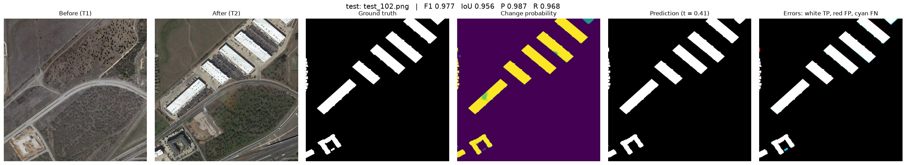
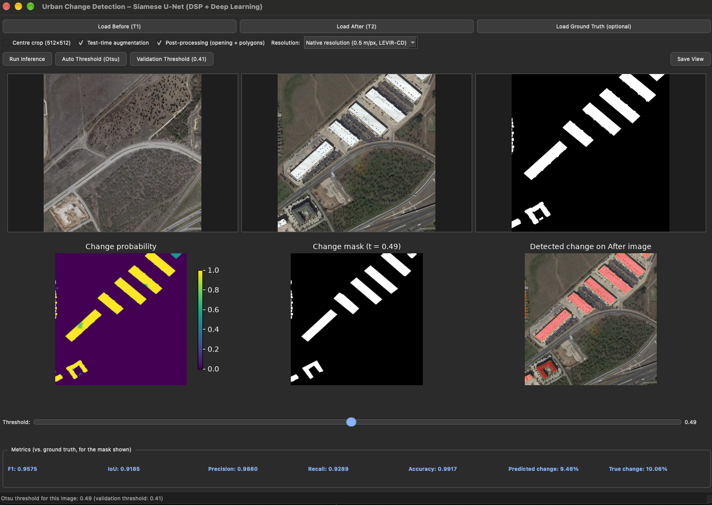

# Urban Change Detection with DSP and Deep Learning

**EEE 312 – Digital Signal Processing I Laboratory · BUET · January 2026 · Level-3 Term-I · Section B2, Group 04**

Mustasin Rahman (2206104) · Fahim Shahriyar (2206114) · Md. Ahasan Habib Kawsar (2206119) · Md. Kawsar Ahmed (2206122)

Detects new (or demolished) buildings between two satellite images of the same place taken at different times. A classical DSP front-end (BT.601 grayscale → 5 × 5 Gaussian low-pass filter → Canny edge detector) produces an edge map that is added to the RGB image as a 4th channel. A Siamese ResNet-34 U-Net with spatial-temporal attention (BAM), Siam-Concat fusion and an edge-guided decoder predicts the change map. Full 1024 × 1024 scenes are predicted with a cosine-blended sliding window and test-time augmentation, and a PyQt5 desktop app makes the system usable without code.



| Deliverable | Link |
|---|---|
| Project report | [`report/Group04_EEE312_Project_Report.docx`](report/Group04_EEE312_Project_Report.docx) |
| Presentation slides | [`presentation/Group04_EEE312_Final_Presentation.pptx`](presentation/Group04_EEE312_Final_Presentation.pptx) |
| Video script | [`presentation/VIDEO_SCRIPT.md`](presentation/VIDEO_SCRIPT.md) |
| Project video (YouTube) | *link will be added soon* |
| Trained model | [Releases page](https://github.com/ahasanhabibkawsar/EEE-312-Group-04-Urban-change-detection-DSP-deep-learning-/releases) |

## Results

LEVIR-CD test set: 128 image pairs, 1024 × 1024 px, 0.5 m/px. Metrics are **dataset-level** (TP/FP/FN/TN summed over all 134 million test pixels, the convention used in the literature). The decision threshold of 0.41 was selected on the **validation** set; the test set was never used for training, model selection or threshold choice.

| Precision | Recall | F1 | IoU | Overall accuracy | Cohen's κ |
|---|---|---|---|---|---|
| 91.76 % | 90.59 % | **91.17 %** | **83.78 %** | 99.11 % | 0.907 |

Confusion counts: TP 6,194,312 · FP 556,557 · FN 643,092 · TN 126,823,767. Per-image mean F1 is 84.04 % (lower, because small changes in single images weigh as much as large ones). The best threshold that could be chosen on the test set (0.36) would give F1 91.18 %, so the result is not over-tuned.

### Ablations and first prototype (same 128 test images, threshold 0.41)

| Configuration | Input | Precision | Recall | F1 | IoU | Results folder |
|---|---|---|---|---|---|---|
| v1 prototype (256 × 256 resized, 3 defects) | RGB + Canny | 75.78 % | 78.50 % | 77.12 % | 62.76 % | `_v1_baseline/` |
| v2, no TTA | RGB + Canny | 91.83 % | 89.74 % | 90.77 % | 83.10 % | `evaluation_results_no_tta/` |
| **v2 + TTA (final)** | RGB + Canny | 91.76 % | 90.59 % | **91.17 %** | **83.78 %** | `evaluation_results/` |
| v2 + TTA, DSP ablation | RGB only | 91.78 % | 91.48 % | 91.63 % | 84.56 % | `evaluation_results_rgb_only/` |

* Fixing the v1 pipeline (native resolution, correct input standardisation, batch-independent attention) gave **+14.05 F1 points**.
* Test-time augmentation adds +0.40 F1 / +0.68 IoU.
* **Removing the Canny channel did not lower accuracy.** On LEVIR-CD the fixed-threshold edge map gives no measurable gain, because the ImageNet-pre-trained encoder already learns edge filters in its first layer. We report this negative result openly; learnable DSP filters are listed as future work.

### Comparison with published methods (F1 on LEVIR-CD, as reported by Bandara & Patel, 2022)

| FC-EF | FC-Siam-diff | STANet | BIT | ChangeFormer | **This work** |
|---|---|---|---|---|---|
| 83.40 | 86.31 | 87.26 | 89.31 | 90.40 | **91.17** |

Our number uses sliding-window inference with TTA, so the comparison is indicative.

### Known limitations

* Errors concentrate on very small objects (mobile homes 3–5 px wide) and re-roofed buildings (appearance change without new construction).
* Trained only on US suburbs. On dense Bangladeshi scenes (Bashundhara / Purbachal, Dhaka) the model detects few changes, which is a domain-shift problem that needs local training data.

## 1. Installation

```bash
git clone https://github.com/ahasanhabibkawsar/EEE-312-Group-04-Urban-change-detection-DSP-deep-learning-.git
cd EEE-312-Group-04-Urban-change-detection-DSP-deep-learning-
python3 -m venv .venv && source .venv/bin/activate      # Windows: .venv\Scripts\activate
pip install -r requirements.txt
```

Tested with Python 3.10+ and PyTorch 2.x on macOS (Apple MPS). CUDA and CPU also work.

## 2. Trained model

The model file (~100 MB) is too large for the repository, so it is attached to the **Releases** page.

1. Download `best_model.pth` from [Releases](https://github.com/ahasanhabibkawsar/EEE-312-Group-04-Urban-change-detection-DSP-deep-learning-/releases).
2. Put it in the `checkpoints/` folder (`checkpoints/best_threshold.json` is already in the repository).

## 3. Dataset (only needed for training / evaluation)

Download LEVIR-CD from the authors' page (https://justchenhao.github.io/LEVIR/) and arrange it as:

```
data/LEVIR-CD/{train,val,test}/{A,B,label}/*.png
```

Split: 445 train / 64 validation / 128 test image pairs.

## 4. User manual: GUI

```bash
python app.py
```



1. **Load Before (T1)** and **Load After (T2)**: any two co-registered RGB images of the same area (PNG / JPG / TIFF).
2. *(Optional)* **Load Ground Truth**: a binary mask; the metrics panel then shows F1, IoU, precision and recall live.
3. Options: **Test-time augmentation** (more accurate, ~4× slower), **Post-processing** (removes speckles, straightens outlines into polygons), **Centre crop 512**, **Resolution** (choose the option matching your image's ground resolution; LEVIR-CD is 0.5 m/pixel).
4. Press **Run Inference**. The window stays responsive while the model runs.
5. Move the **Threshold** slider to trade false alarms against misses. **Validation Threshold** restores 0.41 and **Auto Threshold (Otsu)** picks one per image.
6. **Save View** exports a six-panel PNG.

## 5. Command-line use

| Task | Command |
|---|---|
| Check the installation (1–3 min) | `python sanity_check.py` |
| Train (≈ 5 h on an Apple M-series laptop, best epoch 32) | `python train.py` |
| Resume training | `python train.py --resume` |
| RGB-only ablation | `python train.py --no-canny` |
| Evaluate on the test set | `python evaluate.py --tta` |
| Per-image results for any folder with A/ and B/ | `python test_all_inference.py --data-dir <folder>` |
| DSP stage figures | `python visualization_slide.py data/LEVIR-CD/test/B/test_1.png` |

## 6. Method summary

| Stage | Details |
|---|---|
| DSP front-end | Grayscale (ITU-R BT.601) → Gaussian 5 × 5, σ = 1 → Canny (Sobel gradients, non-max suppression, hysteresis 50/150). Edge channel standardised (μ = 0.12, σ = 0.33); RGB with ImageNet statistics. |
| Encoder | Shared-weight (Siamese) ResNet-34, ImageNet pre-trained, first conv extended to 4 channels; features at 1/2 … 1/32. |
| Fusion | BAM spatial-temporal attention (both dates side by side, pooled keys/values, γ = 0 init) + Siam-Concat [F1, F2, abs(F1 − F2)] → 1 × 1 conv at every scale. |
| Decoder | U-Net 1/32 → 1/2, ×2 up-sampling, 3 × 3 full-resolution refinement; auxiliary edge head (Sobel-derived targets) feeds the decoder. 26.0 M parameters. |
| Loss | BCE + Dice + 0.4 × class-balanced edge BCE. |
| Training | 4 random 256 × 256 crops per image per epoch (30 % change-centred), synchronised flips/rotations + independent photometric jitter per date; AdamW 1e-4, warm-up + cosine, batch 4, early stopping (patience 15). |
| Inference | 256-px tiles, 64-px overlap, cosine-window blending, 4-view TTA, threshold 0.41; optional morphological opening + Douglas–Peucker polygons. |

## 7. Project structure

```
config.py              all settings (paths, DSP parameters, training, threshold)
preprocessing/         Gaussian + Canny DSP front-end, channel standardisation
dataset/               LEVIR-CD dataset, random crops, synchronised augmentation
models/                ResNet-34 Siamese encoder, BAM + Siam-Concat fusion, decoder, edge head
losses/                BCE + Dice + class-balanced edge loss
training/              training loop, dataset-level metrics, threshold sweep
inference/             prediction on arbitrary image pairs, post-processing
evaluation/            figures and reports
gui/app.py             PyQt5 application (app.py is a launcher)
train.py, evaluate.py, sanity_check.py, test_all_inference.py
checkpoints/           best_threshold.json, training history (model file: see Releases)
evaluation_results*/   test-set metrics and figures (final model, no-TTA and RGB-only ablations)
report/                final project report
presentation/          slides and video script
docs/                  images used in this README
CHANGES_v2.md          bugs found in v1 and how they were fixed
_v1_baseline/          first prototype (code, history, metrics) kept for comparison
*_analysis.py, loss_ablation.py, threshold_*.py   additional analysis scripts
```

## 9. References

1. H. Chen and Z. Shi, "A spatial-temporal attention-based method and a new dataset for remote sensing image change detection," *Remote Sensing*, 12(10), 1662, 2020.
2. R. C. Daudt, B. Le Saux, A. Boulch, "Fully convolutional Siamese networks for change detection," ICIP 2018.
3. W. G. C. Bandara and V. M. Patel, "A transformer-based Siamese network for change detection," IGARSS 2022.
4. H. Chen, Z. Qi, Z. Shi, "Remote sensing image change detection with transformers," IEEE TGRS, 2022.
5. K. He et al., "Deep residual learning for image recognition," CVPR 2016.
6. O. Ronneberger, P. Fischer, T. Brox, "U-Net," MICCAI 2015.
7. J. Canny, "A computational approach to edge detection," IEEE TPAMI, 8(6), 1986.
8. F. Milletari, N. Navab, S.-A. Ahmadi, "V-Net," 3DV 2016 (Dice loss).
9. S. Xie and Z. Tu, "Holistically-nested edge detection," ICCV 2015.

The full reference list is in the project report.

The LEVIR-CD dataset belongs to its authors and is used for academic purposes only; it is not redistributed in this repository.
